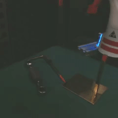
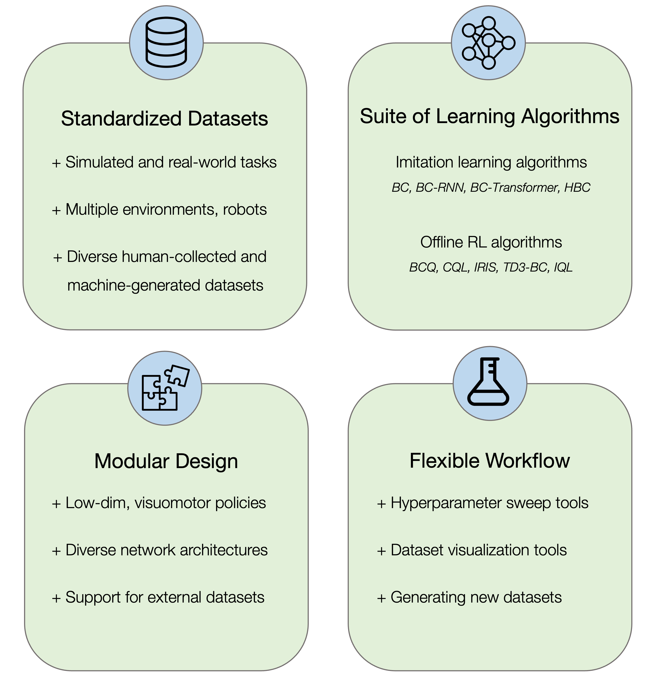

# robomimic

<p align="center">
  
  
  
  
  
  
  
  
 </p>

[**[Homepage]**](https://robomimic.github.io/) &ensp; [**[Documentation]**](https://robomimic.github.io/docs/introduction/overview.html) &ensp; [**[Study Paper]**](https://arxiv.org/abs/2108.03298) &ensp; [**[Study Website]**](https://robomimic.github.io/study/) &ensp; [**[ARISE Initiative]**](https://github.com/ARISE-Initiative)

-------
## Latest Updates
- [06/20/2025] **v0.5.0**: Diffusion Policy, multi-dataset training, language-conditioned policies, and more! 
- [03/11/2025] **v0.4.0**: support for [robosuite v1.5](https://github.com/ARISE-Initiative/robosuite/tree/v1.5.1) and migrate robomimic datasets to HuggingFace
- [10/11/2023] **v0.3.1**: support for extracting, training on, and visualizing depth observations for robosuite datasets
- [07/03/2023] **v0.3.0**: BC-Transformer and IQL :brain:, support for DeepMind MuJoCo bindings :robot:, pre-trained image reps :eye:, wandb logging :chart_with_upwards_trend:, and more
- [05/23/2022] **v0.2.1**: Updated website and documentation to feature more tutorials :notebook_with_decorative_cover:
- [12/16/2021] **v0.2.0**: Modular observation modalities and encoders :wrench:, support for [MOMART](https://sites.google.com/view/il-for-mm/home) datasets :open_file_folder: [[release notes]](https://github.com/ARISE-Initiative/robomimic/releases/tag/v0.2.0) [[documentation]](https://robomimic.github.io/docs/v0.2/introduction/overview.html)
- [08/09/2021] **v0.1.0**: Initial code and paper release

-------

## Colab quickstart
Get started with a quick colab notebook demo of robomimic without installing anything locally.

[](https://colab.research.google.com/drive/1b62r_km9pP40fKF0cBdpdTO2P_2eIbC6?usp=sharing)


-------

**robomimic** is a framework for robot learning from demonstration.
It offers a broad set of demonstration datasets collected on robot manipulation domains and offline learning algorithms to learn from these datasets.
**robomimic** aims to make robot learning broadly *accessible* and *reproducible*, allowing researchers and practitioners to benchmark tasks and algorithms fairly and to develop the next generation of robot learning algorithms.

## Core Features

<p align="center">
  
 </p>

<!-- **Standardized Datasets**
- Simulated and real-world tasks
- Multiple environments and robots
- Diverse human-collected and machine-generated datasets

**Suite of Learning Algorithms**
- Imitation Learning algorithms (BC, BC-RNN, HBC)
- Offline RL algorithms (BCQ, CQL, IRIS, TD3-BC)

**Modular Design**
- Low-dim + Visuomotor policies
- Diverse network architectures
- Support for external datasets

**Flexible Workflow**
- Hyperparameter sweep tools
- Dataset visualization tools
- Generating new datasets -->


## Reproducing benchmarks

The robomimic framework also makes reproducing the results from different benchmarks and datasets easy. See the [datasets page](https://robomimic.github.io/docs/datasets/overview.html) for more information on downloading datasets and reproducing experiments.

## Docker

You can use the `Dockerfile` to easily build a containerized environment for setting up robomimic with Python 3.9, Miniconda, robosuite, and PyTorch (CPU/GPU support).

To build, run:
`docker build -t robomimic .`

To run without GPU (CPU only), run:
`docker run -it robomimic`

To run with GPU (if available), run:
`docker run --gpus all -it robomimic`

## Troubleshooting

Please see the [troubleshooting](https://robomimic.github.io/docs/miscellaneous/troubleshooting.html) section for common fixes, or [submit an issue](https://github.com/ARISE-Initiative/robomimic/issues) on our github page.

## Contributing to robomimic
This project is part of the broader [Advancing Robot Intelligence through Simulated Environments (ARISE) Initiative](https://github.com/ARISE-Initiative), with the aim of lowering the barriers of entry for cutting-edge research at the intersection of AI and Robotics.
The project originally began development in late 2018 by researchers in the [Stanford Vision and Learning Lab](http://svl.stanford.edu/) (SVL).
Now it is actively maintained and used for robotics research projects across multiple labs.
We welcome community contributions to this project.
For details please check our [contributing guidelines](https://robomimic.github.io/docs/miscellaneous/contributing.html).

## Citation

Please cite [this paper](https://arxiv.org/abs/2108.03298) if you use this framework in your work:

```bibtex
@inproceedings{robomimic2021,
  title={What Matters in Learning from Offline Human Demonstrations for Robot Manipulation},
  author={Ajay Mandlekar and Danfei Xu and Josiah Wong and Soroush Nasiriany and Chen Wang and Rohun Kulkarni and Li Fei-Fei and Silvio Savarese and Yuke Zhu and Roberto Mart\'{i}n-Mart\'{i}n},
  booktitle={Conference on Robot Learning (CoRL)},
  year={2021}
}
```
