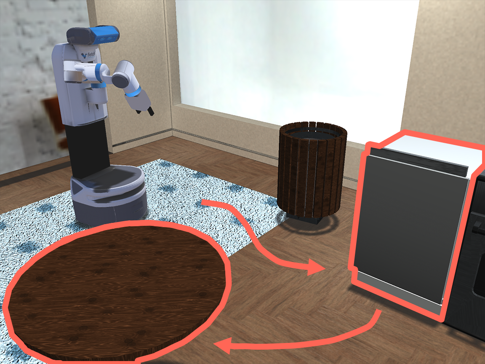
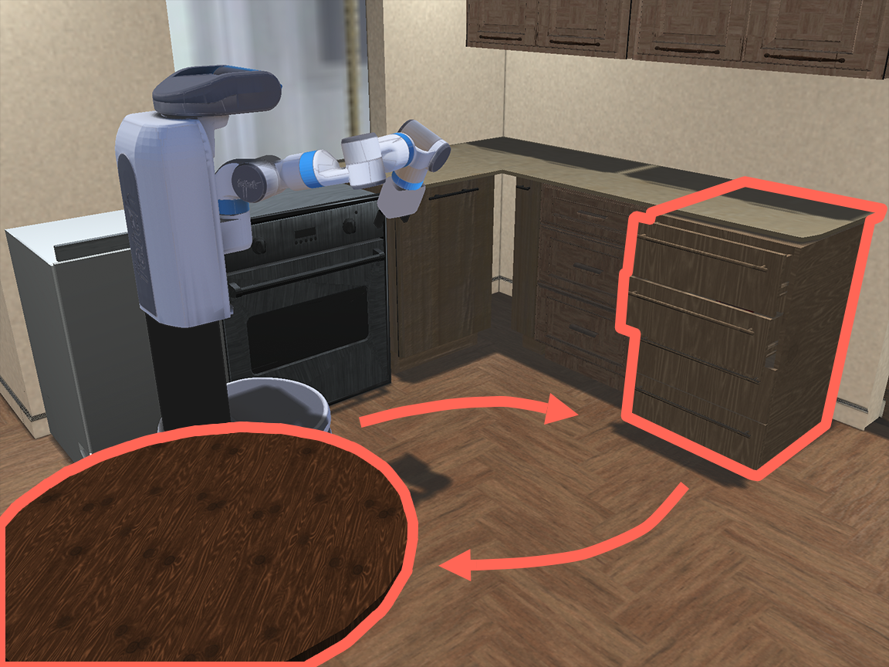
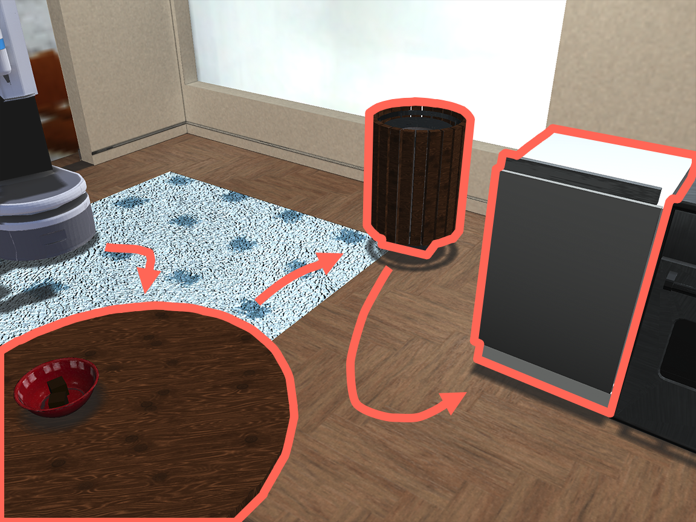
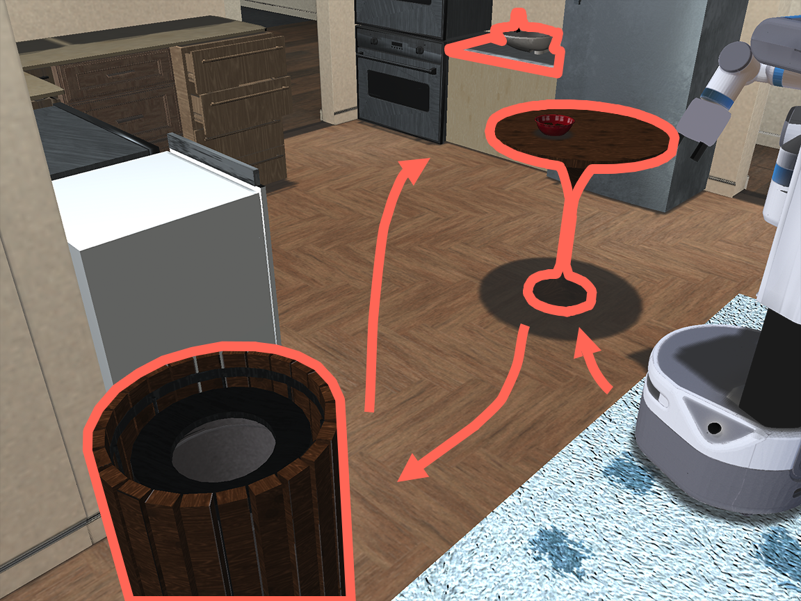
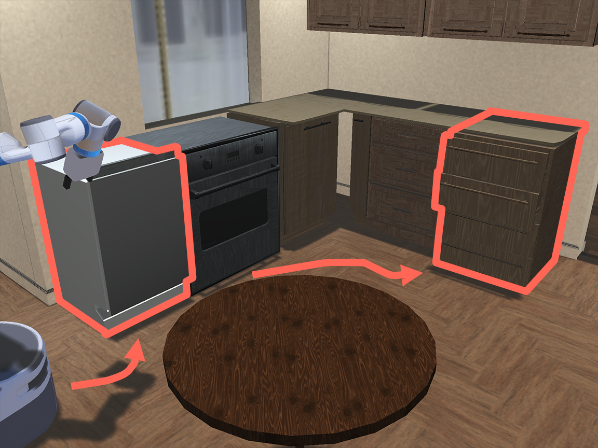
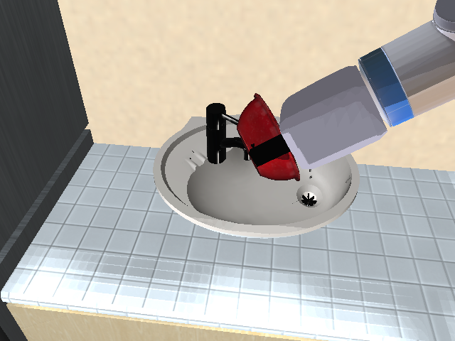
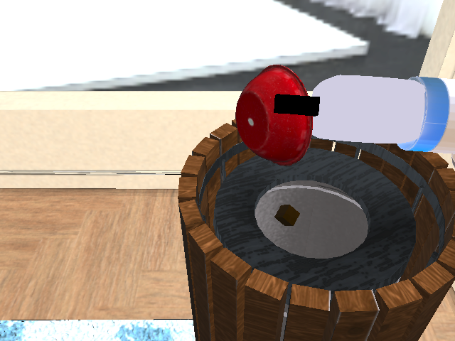
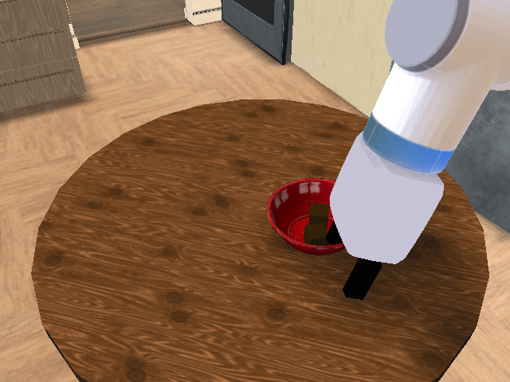
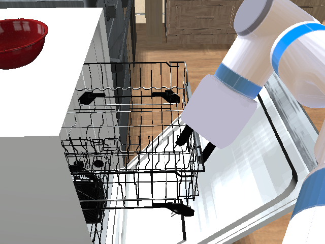
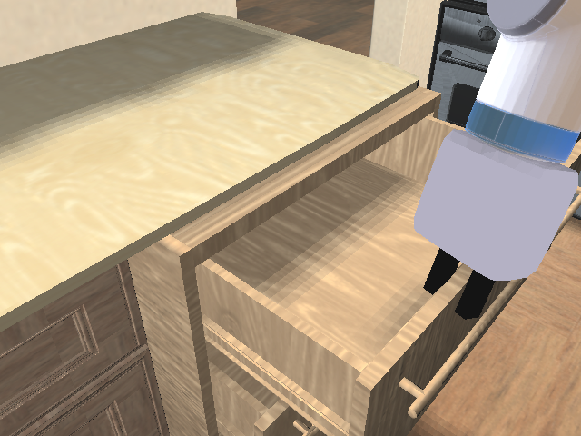

# MOMART Datasets and Experiments

## Overview
[Mobile Manipulation RoboTurk (MoMaRT)](https://sites.google.com/view/il-for-mm/home) datasets are a collection of demonstrations collected on 5 long-horizon robot mobile manipulation tasks in a realistic simulated kitchen.

<p align="center">
  
  
  
  
  
  
  
  
  
  
 </p>

## Downloading


<div class="admonition warning">
<p class="admonition-title">Warning!</p>

When working with these datasets, please make sure that you have installed [iGibson](http://svl.stanford.edu/igibson/) from source and are on the `momart` branch. Exact steps for installing can be found [HERE](https://sites.google.com/view/il-for-mm/datasets#h.qw0vufk0hknk).

</div>

We provide two ways for downloading MOMART datasets:

### Method 1: Using `download_momart_datasets.py` (Recommended)
`download_momart_datasets.py` is a python script that provides a programmatic way of installing all datasets. This is the preferred method, because this script also sets up a directory structure for the datasets that works out of the box with examples for reproducing [MOMART paper's](https://arxiv.org/abs/2112.05251) results.

```sh
# Use --help flag to view download and <ARG> options
python <ROBOMIMIC_DIR>/robomimic/scripts/download_momart_datasets.py <ARGS> 
```

### Method 2: Using Direct Download Links

For each type of dataset, we also provide a direct download links that will download the raw HDF5 file [HERE](https://sites.google.com/view/il-for-mm/datasets#h.ko0ilbky4y5u).

## Postprocessing

No postprocessing is needed for these datasets!

## Citation
```sh
@inproceedings{wong2022error,
  title={Error-Aware Imitation Learning from Teleoperation Data for Mobile Manipulation},
  author={Wong, Josiah and Tung, Albert and Kurenkov, Andrey and Mandlekar, Ajay and Fei-Fei, Li and Savarese, Silvio and Mart{\'\i}n-Mart{\'\i}n, Roberto},
  booktitle={Conference on Robot Learning},
  pages={1367--1378},
  year={2022},
  organization={PMLR}
}
```