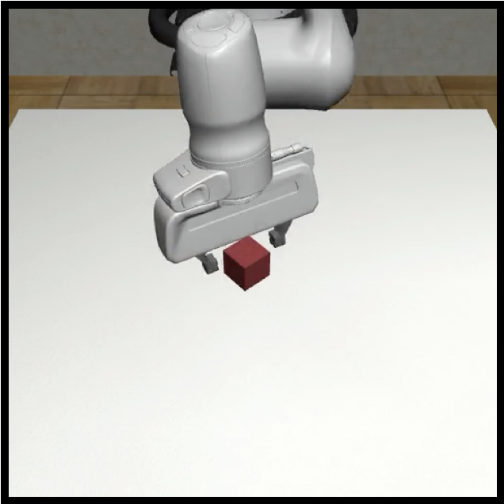

# robomimic v0.1 (CoRL 2021)

## Overview
robomimic v0.1 datasets is a large-scale, diverse collection of task demonstrations spanning:

- multiple human demonstrators of varying quality
- multiple robot manipulation tasks of varying difficulty
- both simulated and real data

## Downloading


<div class="admonition warning">
<p class="admonition-title">Warning!</p>

When working with these datasets, please make sure that you have installed [robosuite](https://robosuite.ai/) from source and are on the `offline_study` branch.

</div>

We provide two ways for downloading robomimic v0.1 datasets:

### Method 1: Using `download_datasets.py` (Recommended)
`download_datasets.py` is a python script that provides a programmatic way of installing all datasets. This is the preferred method, because this script also sets up a directory structure for the datasets that works out of the box with examples for reproducing benchmark results.

A few examples of using this script are provided below:

```sh
# default behavior - just download lift proficient-human low-dim dataset
$ python download_datasets.py

# download low-dim proficient-human datasets for all simulation tasks
# (do a dry run first to see which datasets would be downloaded)
$ python download_datasets.py --tasks sim --dataset_types ph --hdf5_types low_dim --dry_run
$ python download_datasets.py --tasks sim --dataset_types ph --hdf5_types low_dim

# download all low-dim and image multi-human datasets for the can and square tasks
$ python download_datasets.py --tasks can square --dataset_types mh --hdf5_types low_dim image

# download the sparse reward machine-generated low-dim datasets
$ python download_datasets.py --tasks all --dataset_types mg --hdf5_types low_dim_sparse

# download all real robot datasets
$ python download_datasets.py --tasks real

# specify a different location for downloading the datasets
$ python download_datasets.py --download_dir /tmp/datasets
```

### Method 2: Using Direct Download Links

For each type of dataset, we also provide a direct download links that will download the raw HDF5 file – it allows flexibility in extracting different kinds of observations and rewards:

**Proficient-Human (PH)** [**info**](robomimic_v0.1.html#proficient-human-ph)

<details>
  <summary><b>Download Links</b></summary>
<p>


|                      **Lift<br />(PH)**                      |                      **Can<br />(PH)**                       |                     **Square<br />(PH)**                     |                   **Transport<br />(PH)**                    |                   **Tool Hang<br />(PH)**                    |
| :----------------------------------------------------------: | :----------------------------------------------------------: | :----------------------------------------------------------: | :----------------------------------------------------------: | :----------------------------------------------------------: |
|                                   |                                     |                               |                         |                         |
| [raw](http://downloads.cs.stanford.edu/downloads/rt_benchmark/lift/ph/demo.hdf5)<br />(21 MB) | [raw](http://downloads.cs.stanford.edu/downloads/rt_benchmark/can/ph/demo.hdf5)<br />(45 MB) | [raw](http://downloads.cs.stanford.edu/downloads/rt_benchmark/square/ph/demo.hdf5)<br />(49 MB) | [raw](http://downloads.cs.stanford.edu/downloads/rt_benchmark/transport/ph/demo.hdf5)<br />(185 MB) | [raw](http://downloads.cs.stanford.edu/downloads/rt_benchmark/tool_hang/ph/demo.hdf5)<br />(127 MB) |
| [low_dim](http://downloads.cs.stanford.edu/downloads/rt_benchmark/lift/ph/low_dim.hdf5)<br />(18 MB) | [low_dim](http://downloads.cs.stanford.edu/downloads/rt_benchmark/can/ph/low_dim.hdf5)<br />(44 MB) | [low_dim](http://downloads.cs.stanford.edu/downloads/rt_benchmark/square/ph/low_dim.hdf5)<br />(48 MB) | [low_dim](http://downloads.cs.stanford.edu/downloads/rt_benchmark/transport/ph/low_dim.hdf5)<br />(296 MB) | [low_dim](http://downloads.cs.stanford.edu/downloads/rt_benchmark/tool_hang/ph/low_dim.hdf5)<br />(193 MB) |
| [image](http://downloads.cs.stanford.edu/downloads/rt_benchmark/lift/ph/image.hdf5)<br />(801 MB) | [image](http://downloads.cs.stanford.edu/downloads/rt_benchmark/can/ph/image.hdf5)<br />(1.9 GB) | [image](http://downloads.cs.stanford.edu/downloads/rt_benchmark/square/ph/image.hdf5)<br />(2.5 GB) | [image](http://downloads.cs.stanford.edu/downloads/rt_benchmark/transport/ph/image.hdf5)<br />(16 GB) | [image](http://downloads.cs.stanford.edu/downloads/rt_benchmark/tool_hang/ph/image.hdf5)<br />(63 GB) |

|                   **Lift Real<br />(PH)**                    |                    **Can Real<br />(PH)**                    |                 **Tool Hang Real<br />(PH)**                 |
| :----------------------------------------------------------: | :----------------------------------------------------------: | :----------------------------------------------------------: |
|                         |                           |               |
| [image](http://downloads.cs.stanford.edu/downloads/rt_benchmark/lift_real/ph/demo.hdf5) (1.9 GB) | [image](http://downloads.cs.stanford.edu/downloads/rt_benchmark/can_real/ph/demo.hdf5) (5.3 GB) | [image](http://downloads.cs.stanford.edu/downloads/rt_benchmark/tool_hang_real/ph/demo.hdf5) (58 GB) |

</p>
</details>

<br/>
<br/>

**Multi-Human (MH)** [**info**](robomimic_v0.1.html#multi-human-mh)

<details>
  <summary><b>Download Links</b></summary>
<p>


|                      **Lift<br />(MH)**                      |                      **Can<br />(MH)**                       |                     **Square<br />(MH)**                     |                   **Transport<br />(MH)**                    |
| :----------------------------------------------------------: | :----------------------------------------------------------: | :----------------------------------------------------------: | :----------------------------------------------------------: |
|                                   |                                     |                               |                         |
| [raw](http://downloads.cs.stanford.edu/downloads/rt_benchmark/lift/mh/demo.hdf5)<br />(20 MB) | [raw](http://downloads.cs.stanford.edu/downloads/rt_benchmark/can/mh/demo.hdf5)<br />(51 MB) | [raw](http://downloads.cs.stanford.edu/downloads/rt_benchmark/square/mh/demo.hdf5)<br />(45 MB) | [raw](http://downloads.cs.stanford.edu/downloads/rt_benchmark/transport/mh/demo.hdf5)<br />(212 MB) |
| [low_dim](http://downloads.cs.stanford.edu/downloads/rt_benchmark/lift/mh/low_dim.hdf5)<br />(46 MB) | [low_dim](http://downloads.cs.stanford.edu/downloads/rt_benchmark/can/mh/low_dim.hdf5)<br />(108 MB) | [low_dim](http://downloads.cs.stanford.edu/downloads/rt_benchmark/square/mh/low_dim.hdf5)<br />(119 MB) | [low_dim](http://downloads.cs.stanford.edu/downloads/rt_benchmark/transport/mh/low_dim.hdf5)<br />(609 MB) |
| [image](http://downloads.cs.stanford.edu/downloads/rt_benchmark/lift/mh/image.hdf5)<br />(2.6 GB) | [image](http://downloads.cs.stanford.edu/downloads/rt_benchmark/can/mh/image.hdf5)<br />(5.1 GB) | [image](http://downloads.cs.stanford.edu/downloads/rt_benchmark/square/mh/image.hdf5)<br />(6.5 GB) | [image](http://downloads.cs.stanford.edu/downloads/rt_benchmark/transport/mh/image.hdf5)<br />(32 GB) |

</p>
</details>

<br/>
<br/>

**Machine-Generated (MG)** [**info**](robomimic_v0.1.html#machine-generated-mg)

<details>
  <summary><b>Download Links</b></summary>
<p>


|                      **Lift<br />(MG)**                      |                      **Can<br />(MG)**                       |
| :----------------------------------------------------------: | :----------------------------------------------------------: |
|                                   |                                     |
| [raw](http://downloads.cs.stanford.edu/downloads/rt_benchmark/lift/mg/demo.hdf5)<br />(96 MB) | [raw](http://downloads.cs.stanford.edu/downloads/rt_benchmark/can/mg/demo.hdf5)<br />(457 MB) |
| [low_dim (sparse)](http://downloads.cs.stanford.edu/downloads/rt_benchmark/lift/mg/low_dim_sparse.hdf5)<br />(303 MB) | [low_dim (sparse)](http://downloads.cs.stanford.edu/downloads/rt_benchmark/can/mg/low_dim_sparse.hdf5)<br />(1.1 GB) |
| [low_dim (dense)](http://downloads.cs.stanford.edu/downloads/rt_benchmark/lift/mg/low_dim_dense.hdf5)<br />(303 MB) | [low_dim (dense)](http://downloads.cs.stanford.edu/downloads/rt_benchmark/can/mg/low_dim_dense.hdf5)<br />(1.1 GB) |
| [image (sparse)](http://downloads.cs.stanford.edu/downloads/rt_benchmark/lift/mg/image_sparse.hdf5)<br />(19 GB) | [image (sparse)](http://downloads.cs.stanford.edu/downloads/rt_benchmark/can/mg/image_sparse.hdf5)<br />(48 GB) |
| [image (dense)](http://downloads.cs.stanford.edu/downloads/rt_benchmark/lift/mg/image_dense.hdf5)<br />(19 GB) | [image (dense)](http://downloads.cs.stanford.edu/downloads/rt_benchmark/can/mg/image_dense.hdf5)<br />(48 GB) |

</p>
</details>

<br/>
<br/>

**Paired** [**info**](robomimic_v0.1.html#paired)

<details>
  <summary><b>Download Links</b></summary>
<p>

|                        **Can Paired**                        |
| :----------------------------------------------------------: |
|  |
| [raw](http://downloads.cs.stanford.edu/downloads/rt_benchmark/can/paired/demo.hdf5)<br />(39 MB) |
| [low_dim (sparse)](http://downloads.cs.stanford.edu/downloads/rt_benchmark/can/paired/low_dim.hdf5)<br />(39 MB) |
| [image (sparse)](http://downloads.cs.stanford.edu/downloads/rt_benchmark/can/paired/image.hdf5)<br />(1.7 GB) |

</p>
</details>

## Postprocessing
If a **low_dim** or **image** dataset was downloaded, the dataset works out of the box! No postprocessing is needed.

If a **raw** dataset was downloaded, the dataset must be postprocessed since there are no observations stored. You must run `dataset_states_to_obs.py`. For more information, see [this page](robosuite.html#extracting-observations-from-mujoco-states).

## Info

Below, we provide information on each dataset provided:

### Proficient-Human (PH)

These datasets were collected by 1 operator using the [RoboTurk](https://roboturk.stanford.edu/) platform. Each dataset consists of 200 successful trajectories.

### Multi-Human (MH)

These datasets were collected by 6 operators using the [RoboTurk](https://roboturk.stanford.edu/) platform. Each dataset consists of 50 trajectories provided by each operator, for a total of 300 successful trajectories. The operators were varied in proficiency -- there were 2 "worse" operators, 2 "okay" operators, and 2 "better" operators, resulting in diverse, mixed quality datasets.

### Machine-Generated (MG)

These datasets were generated by [training](https://github.com/ARISE-Initiative/robosuite-benchmark) an [SAC](https://arxiv.org/abs/1801.01290) agent for each task, and then using each policy checkpoint saved during training to generate a mixed quality dataset. 300 rollouts were collected for each checkpoint, with 5 checkpoints for the Lift dataset (total of 1500 trajectories), and 13 checkpoints for the Can dataset (total of 3900 trajectories).

### Paired

This is a diagnostic dataset to test the ability of algorithms to learn from mixed quality human data. A single experienced operator collected 2 demonstrations for each of 100 task initializations on the Can task, resulting in 200 total demonstrations. Each pair of demonstrations consists of a "good" trajectory, where the can is picked up and placed in the correct bin, and a "bad" trajectory, where the can is picked up, and tossed outside of the robot workspace. Since the task initializations are identical, and the first part of each trajectory leading up to the can grasp is similar, there is a strong expectation for algorithms that deal with suboptimal data, to be able to filter the good trajectories from the bad ones, and achieve near-perfect performance.

## [Study](https://arise-initiative.github.io/robomimic-web/study/) Results Using the Datasets

### Reproducing Experiments

After downloading the appropriate datasets you're interested in using by running the `download_datasets.py` script, the `generate_paper_configs.py` script can be used to generate all training config json files necessary to reproduce the experiments in the [study](https://arise-initiative.github.io/robomimic-web/study/). The script takes 3 important arguments -- `--config_dir` can be used to specify where the config json files will be generated (defaults to `robomimic/exps/paper`). The `--dataset_dir` specifies where the released datasets can be found, and should be consistent with the `--download_dir` argument supplied to `download_datasets.py` earlier (if omitted, both scripts default to `robomimic/../datasets`). The `--output_dir` argument specifies where training results will be written (including model checkpoints, logs, and rollout videos). A few examples are below.

```sh
# Assume datasets already exist in robomimic/../datasets folder. Configs will be generated under robomimic/exps/paper, and training results will be at /tmp/experiment_results when launching training runs.
$ python generate_paper_configs.py --output_dir /tmp/experiment_results

# Alternatively, specify where datasets exist, and specify where configs should be generated.
$ python generate_paper_configs.py --config_dir /tmp/configs --dataset_dir /tmp/datasets --output_dir /tmp/experiment_results
```

Then, to reproduce a specific set of training runs for different experiment groups (see below), we can simply navigate to the generated config directory, and copy training commands from the generated shell script there. As an example, we can reproduce the low-dim BC and BC-RNN training results on the Lift PH dataset, by looking for the correct set of commands in `robomimic/exps/paper/core.sh` and running them. The relevant section of the shell script is reproduced below.

```bash
#  task: lift
#    dataset type: ph
#      hdf5 type: low_dim
python /path/to/robomimic/scripts/train.py --config /path/to/robomimic/exps/paper/core/lift/ph/low_dim/bc.json
python /path/to/robomimic/scripts/train.py --config /path/to/robomimic/exps/paper/core/lift/ph/low_dim/bc_rnn.json
```

### Overview of Included Experiments

Each group of experiments below has a shell script (for example `core.sh`) and a folder that is generated by the `generate_paper_configs.py` script at `--config_dir` (defaults to `robomimic/exps/paper`). The Tables and Figures below refer to the ones in this paper.

- **core:** the main experiment results across all tasks, datasets, and observation spaces. This includes the results in Table 1, Table 3, and Table 16

- **subopt:** results on suboptimal data subsets of the multi-human datasets (with the exception of results on the can-paired dataset, which are actually contained in `core` above). This includes Table 2, Table 17, Table 23, and Table 24.

- **dataset_size:** results on the 20% and 50% size subsets. This includes Figure 3, Table 27, and Table 28.

- **obs_ablation:** results on different observation spaces from the study. This includes Figure 2a, Table 22, and Table 25.

- **hyper_ablation:** results on the hyperparameter sensitivity study. This includes Figure 2b, Figure 2c, and Table 26.

- **d4rl:** results on D4RL datasets (see section below)


### Quick Example

Below, we show a simple example of how to reproduce one of the results from the study - the BC-RNN result on the Lift (Proficient-Human) low-dim dataset:

```sh
# default behavior for download script - just download lift proficient-human low-dim dataset to robomimic/../datasets
$ python download_datasets.py

# generate json configs for running all experiments at robomimic/exps/paper
$ python generate_paper_configs.py --output_dir /tmp/experiment_results

# the training command can be found in robomimic/exps/paper/core.sh
# Training results can be viewed at /tmp/experiment_results (--output_dir when generating paper configs).
$ python train.py --config ../exps/paper/core/lift/ph/low_dim/bc.json
```

## Citation

```sh
@inproceedings{mandlekar2021matters,
  title={What Matters in Learning from Offline Human Demonstrations for Robot Manipulation},
  author={Mandlekar, Ajay and Xu, Danfei and Wong, Josiah and Nasiriany, Soroush and Wang, Chen and Kulkarni, Rohun and Fei-Fei, Li and Savarese, Silvio and Zhu, Yuke and Mart{\'\i}n-Mart{\'\i}n, Roberto},
  booktitle={5th Annual Conference on Robot Learning},
  year={2021}
}
```