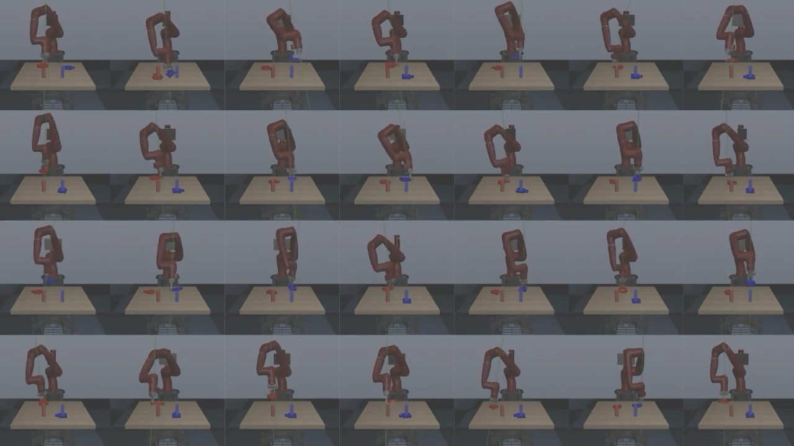

# RoboTurk Pilot

## Overview

The first [RoboTurk paper](https://arxiv.org/abs/1811.02790) released [large-scale pilot datasets](https://roboturk.stanford.edu/dataset_sim.html) collected with robosuite `v0.3`. These datasets consist of over 1000 task demonstrations each on several Sawyer `PickPlace` and `NutAssembly` task variants, collected by several human operators. This repository is fully compatible with these datasets. 




## Downloading

<div class="admonition warning">
<p class="admonition-title">Warning!</p>

When working with these datasets, please make sure that you have installed [robosuite](https://robosuite.ai/) from source and are on the `roboturk_v1` branch.

</div>

Download the dataset (~9GB) [here](http://cvgl.stanford.edu/projects/roboturk/RoboTurkPilot.zip) (~9 GB download), and unzip the file, resulting in a `RoboTurkPilot` folder.

## Postprocessing

First, the dataset must be updated to a format compatible with **robomimic**. Run (kwargs given as an example):
```sh
# convert the Can demonstrations, and also create a "fastest_225" filter_key (prior work such as IRIS has trained on this subset)
$ python conversion/convert_roboturk_pilot.py --folder /path/to/RoboTurkPilot/bins-Can --n 225
```
Then, the dataset must be postprocessed since there are no observations stored. You must run `dataset_states_to_obs.py`. For more information, see [this page](robosuite.html#extracting-observations-from-mujoco-states).

## Citation

```sh
@inproceedings{mandlekar2018roboturk,
  title={Roboturk: A crowdsourcing platform for robotic skill learning through imitation},
  author={Mandlekar, Ajay and Zhu, Yuke and Garg, Animesh and Booher, Jonathan and Spero, Max and Tung, Albert and Gao, Julian and Emmons, John and Gupta, Anchit and Orbay, Emre and others},
  booktitle={Conference on Robot Learning},
  pages={879--893},
  year={2018},
  organization={PMLR}
}
```