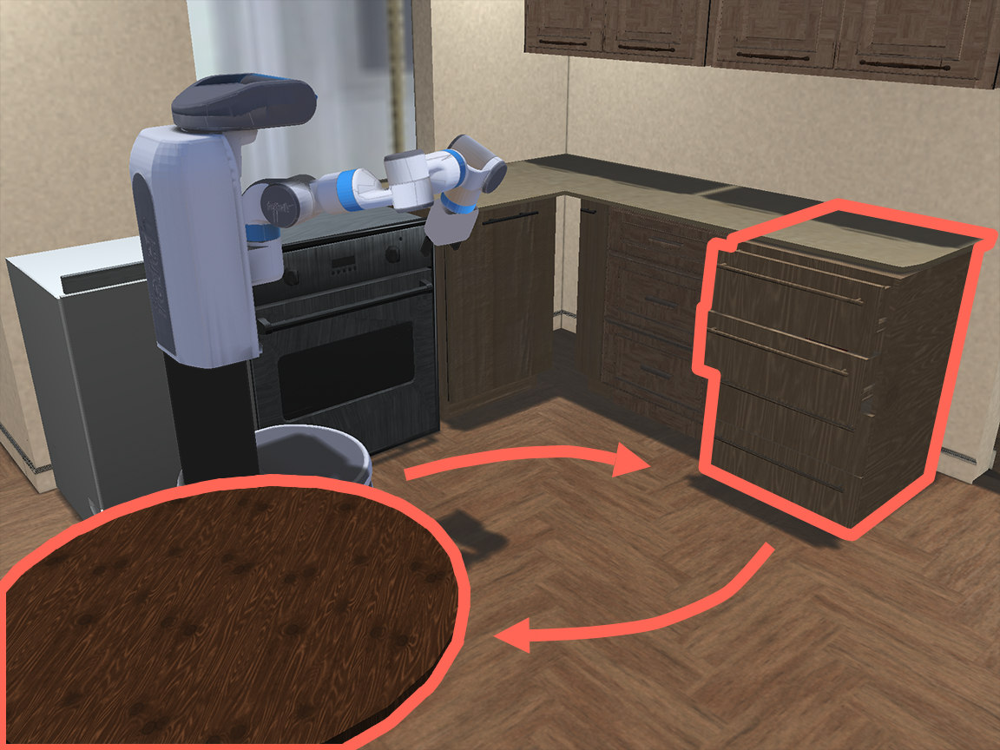
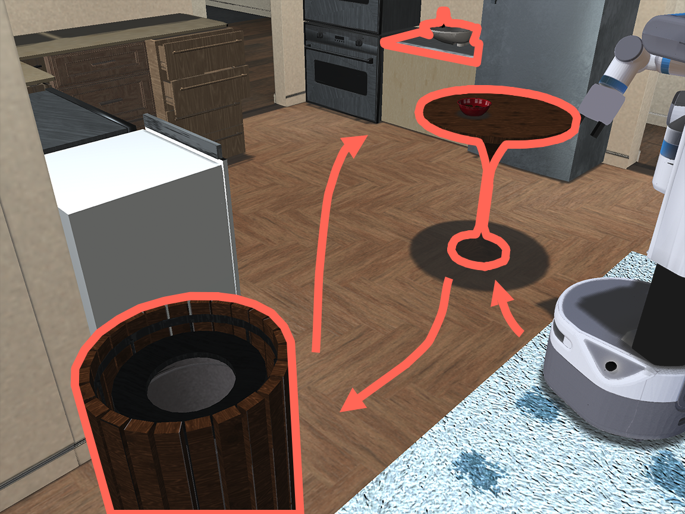
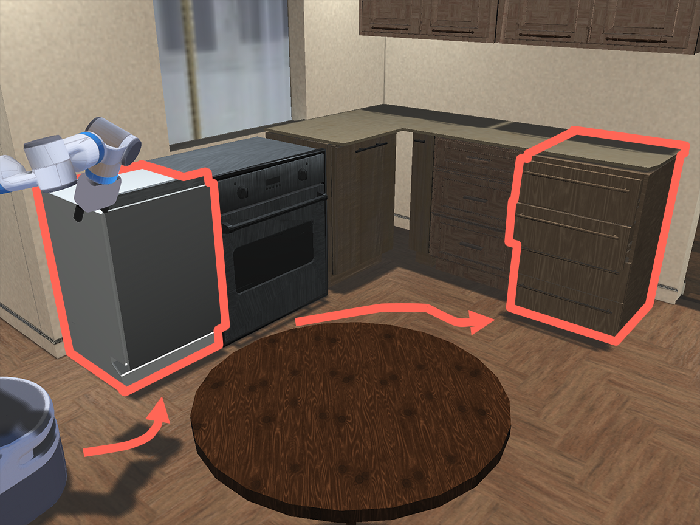

# Using Demonstration Datasets

This section contains information on the hdf5 dataset structure used by **robomimic**, and additional dataset types that we offer conversion scripts for.

## Dataset Structure

The repository expects hdf5 datasets with a certain structure. The structure is shown below.

data (group)

- `total` (attribute) - number of state-action samples in the dataset

- `env_args` (attribute) - a json string that contains metadata on the environment and relevant arguments used for collecting data

- `mask` (group) - this group will exist in hdf5 datasets that contain filter keys

  - `<filter_key_1>` (dataset) - the first filter key. Note that the name of this dataset and length will vary. As an example, this could be the "valid" filter key, and contain the list ["demo_0", "demo_19", "demo_35"], corresponding to 3 validation trajectories.

- `demo_0` (group) - group for the first trajectory (every trajectory has a group)

  - `num_samples` (attribute) - the number of state-action samples in this trajectory

  - `model_file` (attribute) - the xml string corresponding to the MJCF MuJoCo model. Only present for robosuite datasets.

  - `states` (dataset) - flattened raw MuJoCo states, ordered by time. Shape (N, D) where N is the length of the trajectory, and D is the dimension of the state vector. Should be empty or have dummy values for non-robosuite datasets.

  - `actions` (dataset) - environment actions, ordered by time. Shape (N, A) where N is the length of the trajectory, and A is the action space dimension

  - `rewards` (dataset) - environment rewards, ordered by time. Shape (N,) where N is the length of the trajectory.

  - `dones` (dataset) - done signal, equal to 1 if playing the corresponding action in the state should terminate the episode. Shape (N,) where N is the length of the trajectory.

  - `obs` (group) - group for the observation keys. Each key is stored as a dataset.

    - `<obs_key_1>` (dataset) - the first observation key. Note that the name of this dataset and shape will vary. As an example, the name could be "agentview_image", and the shape could be (N, 84, 84, 3). 

      ...

  - `next_obs` (group) - group for the next observations.

    - `<obs_key_1>` (dataset) - the first observation key.

      ...

- `demo_1` (group) - group for the second trajectory

  ...

### Filter Keys and Train-Valid Splits

Each filter key is a dataset in the "mask" group of the dataset hdf5, which contains a list of the demo group keys - these correspond to subsets of trajectories in the dataset. Filter keys make it easy to train on a subset of the data present in an hdf5. A common use is to split a dataset into training and validation datasets using the `split_train_val.py` script. 

```sh
$ python split_train_val.py --dataset /path/to/dataset.hdf5 --ratio 0.1
```

The example above creates a `train` filter key and a `valid` filter key under `mask/train` and `mask/valid`, where the former contains a list of demo groups corresponding to a 90% subset of the dataset trajectories, and the latter contains a list of demo groups correspond to a 10% subset of the dataset trajectories. These filter keys are used by the data loader during training if `config.experiment.validate` is set to True in the training config. 

Many of the released datasets contain other filter keys besides the train-val splits. Some contain `20_percent` and `50_percent` filter keys corresponding to data subsets, and the Multi-Human datasets contain filter keys that correspond to each operator's data (e.g. `better_operator_1`, `better_operator_2`), and ones that correspond to different combinations of operator data (e.g. `better`, `worse_better`). 

Using these filter keys during training is simple. For example, to use the `20_percent` subset during training, you can simply set `config.train.hdf5_filter_key = "20_percent"` in the training config. If using validation, then the `20_percent_train` and `20_percent_valid` filter keys will also be used -- these were generated using the `split_train_val.py` script by passing `--filter_key 20_percent`.

For robosuite datasets, if attempting to create your own train-val splits, we recommend running the `split_train_val.py` script on the `demo.hdf5` file before extracting observations, since filter keys are copied from the source hdf5 during observation extraction (see more details below on robosuite hdf5s). This will ensure that all postprocessed hdf5s generated from the `demo.hdf5` inherits the same filter keys.

### Storing image observations

The repository expects image observations stored in the hdf5 to be of type `np.uint8` and be stored in channel-last `(H, W, C)` format. This is for two reasons - (1) this is a common format that many `gym` environments and all `robosuite` environments return image observations in, and (2) using `np.uint8` saves space in dataset storage, as opposed to using floats. Note that the robosuite observation extraction script (`dataset_states_to_obs.py`) already stores images in the correct format.

### Storing actions

The repository **expects all actions to be normalized** between -1 and 1 (this makes for easier policy learning and allows the use of `tanh` layers). The `get_dataset_info.py` script can be used to sanity check the actions in a dataset, as it will throw an `Exception` if there is a violation.

### View Dataset Structure and Videos

**Note:** The examples in this section use the small hdf5 dataset packaged with the repository in `tests/assets/test.hdf5`, but you can run these examples with any dataset hdf5.

**Warning:** If you are using the default dataset, please make sure that robosuite is on the `offline_study` branch of robosuite -- this is necessary for the playback scripts to function properly.

The repository offers a simple utility script (`get_dataset_info.py`) to view the hdf5 dataset structure and some statistics of hdf5 datasets. The script will print out some statistics about the trajectories, the filter keys present in the dataset, the environment metadata in the dataset, and the dataset structure for the first demonstration. Pass the `--verbose` argument to print the list of demonstration keys under each filter key, and the dataset structure for all demonstrations.

```sh
$ python get_dataset_info.py --dataset ../../tests/assets/test.hdf5
```

The repository also offers a utility script (`playback_dataset.py`) that allows you to easily view dataset trajectories, and verify that the recorded dataset actions are reasonable. The example below loads the saved MuJoCo simulator states one by one in a simulation environment, and renders frames from some simulation cameras to generate a video, for the first 5 trajectories. This is an easy way to view trajectories from the dataset. After this script runs, you can view the video at `/tmp/playback_dataset.mp4`.

```sh
$ python playback_dataset.py --dataset ../../tests/assets/test.hdf5 --render_image_names agentview robot0_eye_in_hand --video_path /tmp/playback_dataset.mp4 --n 5
```

An alternative way to view the demonstrations is to directly visualize the image observations in the dataset. This is especially useful for real robot datasets, where there is no simulator to use for rendering.

```sh
$ python playback_dataset.py --dataset ../../tests/assets/test.hdf5 --use-obs --render_image_names agentview_image --video_path /tmp/obs_trajectory.mp4
```

It's also easy to use the script to verify that the dataset actions are reasonable, by playing the actions back one by one in the environment.

```sh
$ python playback_dataset.py --dataset ../../tests/assets/test.hdf5 --use-actions --render_image_names agentview --video_path /tmp/playback_dataset_with_actions.mp4
```

Finally, the script can be used to visualize the initial states in the demonstration data.

```sh
$ python playback_dataset.py --dataset ../../tests/assets/test.hdf5 --first --render_image_names agentview --video_path /tmp/dataset_task_inits.mp4
```


## Robosuite HDF5 Datasets

The repository is fully compatible with datasets collected using [robosuite](https://robosuite.ai/). See [this link](https://robosuite.ai/docs/algorithms/demonstrations.html) for more information on collecting your own human demonstrations using robosuite. 

### Converting robosuite hdf5 datasets

The raw `demo.hdf5` file generated by the `collect_human_demonstrations.py` robosuite script can easily be modified in-place to be compatible with this repository, by using the following conversion script in the scripts folder.

```sh
$ python conversion/convert_robosuite.py --dataset /path/to/demo.hdf5
```

Afterwards, observations should be extracted from the `demo.hdf5` dataset (see below).

### Structure of raw collected demonstrations

The structure of these converted raw `demo.hdf5` files is very similar to the normal hdf5 dataset structure, and is compatible with scripts such as `get_dataset_info.py` and `playback_dataset.py`, but it is missing observations (such as proprioception, object poses, and images),, rewards, and dones, which are necessary for training policies. Keeping these raw `demo.hdf5` datasets around is a good idea -- it **allows flexibility in extracting different kinds of observations and rewards** (see below section on extracting observations). The structure of these raw datasets is shown below.

- `data` (group)

  - `total` (attribute) - number of state-action samples in the dataset

  - `env_args` (attribute) - a json string that contains metadata on the environment and relevant arguments used for collecting data

  - `demo_0` (group) - group for the first demonstration (every demonstration has a group)

    - `num_samples` (attribute) - the number of state-action samples in this trajectory
    - `model_file` (attribute) - the xml string corresponding to the MJCF MuJoCo model
    - `states` (dataset) - flattened raw MuJoCo states, ordered by time
    - `actions` (dataset) - environment actions, ordered by time

  - `demo_1` (group) - group for the second demonstration

    ...

### Extracting Observations from MuJoCo states

As mentioned above, the `demo.hdf5` file produced by robosuite only contains low-level mujoco states - it does not contain observations (such as proprioception, object poses, and images), rewards, or dones - all of which may be needed for learning. In this section, we show how to postprocess these hdf5 files to produce ones compatible with the training pipeline. We provide two examples below - one of which produces an hdf5 with a low-dim observation space, and one which produces an hdf5 with an image observation space. These commands are similar to the ones we used to produce `low_dim.hdf5` and `image.hdf5` files in our released datasets.

```sh
$ python dataset_states_to_obs.py --dataset /path/to/demo.hdf5 --output_name low_dim.hdf5 --done_mode 2
$ python dataset_states_to_obs.py --dataset /path/to/demo.hdf5 --output_name image.hdf5 --done_mode 2 --camera_names agentview robot0_eye_in_hand --camera_height 84 --camera_width 84
```

Note that we released the `demo.hdf5` files for our collected demonstration data as well - this makes it easy to extract observations directly from these files instead of using the pre-defined observation spaces provided in the `low_dim.hdf5` and `image.hdf5` dataset files. For example, our image observation spaces consisted of the `agentview` and `robot0_eye_in_hand` cameras, with 84x84 images, but if you'd also like the option to train on the `birdview` camera images, and you'd like to increase image resolution to 120x120, you can do that easily using the script.

```sh
$ python dataset_states_to_obs.py --dataset /path/to/demo.hdf5 --output_name custom_image.hdf5 --done_mode 2 --camera_names agentview robot0_eye_in_hand birdview --camera_height 120 --camera_width 120
```

The script can also be used to change the rewards and dones in the dataset. We used sparse rewards and dones on task success and at the end of each trajectory (this corresponds to done mode 2 in the script). However, the script can be used to write dense rewards, or change the done annotation to be 1 only at the end of each trajectory (this corresponds to done mode 1 in the script).

```sh
$ python dataset_states_to_obs.py --dataset /path/to/demo.hdf5 --output_name image_dense.hdf5 --done_mode 2 --dense --camera_names agentview robot0_eye_in_hand --camera_height 84 --camera_width 84
$ python dataset_states_to_obs.py --dataset /path/to/demo.hdf5 --output_name image_done_1.hdf5 --done_mode 1 --camera_names agentview robot0_eye_in_hand --camera_height 84 --camera_width 84
```

For more details on how the released `demo.hdf5` dataset files were used to generate the `low_dim.hdf5` and `image.hdf5` files, please see the `extract_obs_from_raw_datasets.sh` script, which contains the commands that were used for our released datasets.


## MOMART Datasets

<p align="center">
  
  
  
  
  
  
  
  
  
  
 </p>

This repository is fully compatible with [MOMART](https://sites.google.com/view/il-for-mm/home) datasets, a large collection of long-horizon, multi-stage simulated kitchen tasks executed by a mobile manipulator robot. See [this link](https://sites.google.com/view/il-for-mm/datasets) for a breakdown of the MOMART dataset structure, guide on downloading MOMART datasets, and running experiments using the datasets.


## D4RL Datasets

This repository is fully compatible with most [D4RL](https://github.com/rail-berkeley/d4rl) datasets. See [this link](./results.html#d4rl) for a guide on downloading D4RL datasets and running D4RL experiments.


## RoboTurk Pilot Datasets

The first [RoboTurk paper](https://arxiv.org/abs/1811.02790) released [large-scale pilot datasets](https://roboturk.stanford.edu/dataset_sim.html) collected with robosuite `v0.3`. These datasets consist of over 1000 task demonstrations each on several Sawyer `PickPlace` and `NutAssembly` task variants, collected by several human operators. This repository is fully compatible with these datasets. 


To get started, first download the dataset [here](http://cvgl.stanford.edu/projects/roboturk/RoboTurkPilot.zip) (~9 GB download), and unzip the file, resulting in a `RoboTurkPilot` folder. This folder has subdirectories corresponding to each task, each with a raw hdf5 file. You can convert the demonstrations using a command like the one below.

```sh
# convert the Can demonstrations, and also create a "fastest_225" filter_key (prior work such as IRIS has trained on this subset)
$ python conversion/convert_roboturk_pilot.py --folder /path/to/RoboTurkPilot/bins-Can --n 225
```

Next, make sure that you're on the [roboturk_v1](https://github.com/ARISE-Initiative/robosuite/tree/roboturk_v1) branch of robosuite, which is a modified version of v0.3. **You should always be on the roboturk_v1 branch when using these datasets.** Finally, follow the instructions in the above "Extracting Observations from MuJoCo states" section to extract observations from the raw converted `demo.hdf5` file, in order to produce an hdf5 ready for training.