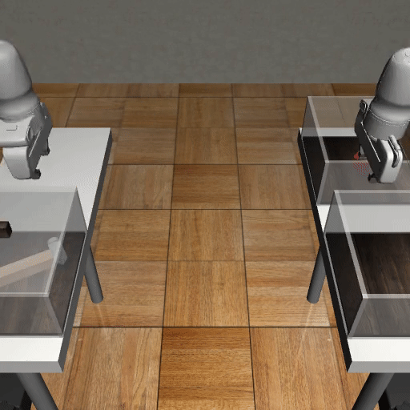

# Overview

<p align="center">
  
  
  
  
  
  
  
  
 </p>

**robomimic** is a framework for robot learning from demonstration. It offers a broad set of demonstration datasets collected on robot manipulation domains, and learning algorithms to learn from these datasets. This project is part of the broader [Advancing Robot Intelligence through Simulated Environments (ARISE) Initiative](https://github.com/ARISE-Initiative), with the aim of lowering the barriers of entry for cutting-edge research at the intersection of AI and Robotics.

Imitating human demonstrations is a promising approach to endow robots with various manipulation capabilities. While recent advances have been made in imitation learning and batch (offline) reinforcement learning, a lack of open-source human datasets and reproducible learning methods make assessing the state of the field difficult. The overarching goal of **robomimic** is to provide researchers and practitioners with:

- a **standardized set of large demonstration datasets** across several benchmarking tasks to facilitate fair comparisons, with a focus on learning from human-provided demonstrations (see [this link](./features.html#supported-datasets) for a list of supported datasets)
- **high-quality implementations of several learning algorithms** for training closed-loop policies from offline datasets to make reproducing results easy and lower the barrier to entry
- a **modular design** that offers great flexibility in extending algorithms and designing new algorithms

This release of **robomimic** contains seven offline learning [algorithms](../modules/algorithms.html) and standardized [datasets](./results.html) collected across five simulated and three real-world multi-stage manipulation tasks of varying complexity. We highlight some features below (for a more thorough list of features, see [this link](./features.html#features-overview)):

- **standardized datasets:** a set of datasets collected from different sources (single proficient human, multiple humans, and machine-generated) across several simulated and real-world tasks, along with a plug-and-play [Dataset class](../modules/datasets.html) to easily use the datasets outside of this project
- **algorithm implementations:** several high-quality implementations of offline learning algorithms, including BC, BC-RNN, HBC, IRIS, BCQ, CQL, and TD3-BC
- **multiple observation spaces:** support for learning both low-dimensional and visuomotor policies, with support for observation tensor dictionaries throughout the codebase, making it easy to specify different subsets of observations to train a policy. This includes a set of useful tensor utilities to work with nested dictionaries of torch Tensors and numpy arrays.
- **visualization utilities:** utilities for visualizing demonstration data, playing back actions, visualizing trained policies, and collecting new datasets using trained policies
- **train launching utilities:** utilities for easily running hyperparameter sweeps, enabled by a flexible [Config](../modules/configs.html) management system

## Contributing to robomimic

This framework originally began development in late 2018. Researchers in the [Stanford Vision and Learning Lab](http://svl.stanford.edu/) (SVL) used it as an internal tool for training policies from offline human demonstration datasets. Now it is actively maintained and used for robotics research projects across multiple labs. We welcome community contributions to this project. For details please check our [contributing guidelines](../miscellaneous/contributing.html).

## Troubleshooting

Please see the [troubleshooting](../miscellaneous/troubleshooting.html) section for common fixes, or [submit an issue](https://github.com/ARISE-Initiative/robomimic/issues) on our github page.

## Reproducing study results

The **robomimic** framework also makes reproducing the results from this [study](https://arise-initiative.github.io/robomimic-web/study.) easy. See the [reproducing results documentation](./results.html) for more information.

## Citations

Please cite [this paper](https://arxiv.org/abs/2108.03298) if you use this framework in your work:

```
@inproceedings{robomimic2021,
  title={What Matters in Learning from Offline Human Demonstrations for Robot Manipulation},
  author={Ajay Mandlekar and Danfei Xu and Josiah Wong and Soroush Nasiriany and Chen Wang and Rohun Kulkarni and Li Fei-Fei and Silvio Savarese and Yuke Zhu and Roberto Mart\'{i}n-Mart\'{i}n},
  booktitle={arXiv preprint arXiv:2108.03298},
  year={2021}
}
```