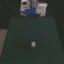

# Overview

<p align="center">
  
  
  
  
  
  
  
  
 </p>

**robomimic** is a framework for robot learning from demonstration.
It offers a broad set of demonstration datasets collected on robot manipulation domains and offline learning algorithms to learn from these datasets.
**robomimic** aims to make robot learning broadly *accessible* and *reproducible*, allowing researchers and practitioners to benchmark tasks and algorithms fairly and to develop the next generation of robot learning algorithms.

## Core Features


<!-- <div style="box-sizing:border-box;" >
<section class="page-section" style="box-sizing:border-box;display:block;" >
    <div class="container" style="box-sizing:border-box;width:100%;padding-right:0.75rem;padding-left:0.75rem;margin-right:auto;margin-left:auto;" >
        <div class="row text-center" style="box-sizing:border-box;display:flex;flex-wrap:wrap;margin-right:-0.75rem;margin-left:-0.75rem;" >
            <div class="col-lg-3 col-md-6" style="box-sizing:border-box;position:relative;width:100%;padding-right:0.75rem;padding-left:0.75rem;flex:0 0 50%;max-width:50%;" >
                <div class="feature-box" style="box-sizing:border-box;background-attachment:scroll;padding-top:30px;padding-bottom:30px;padding-right:20px;padding-left:20px;margin-bottom:50px;text-align:center;border-width:1px;border-style:solid;border-color:#e6e6e6;height:400px;position:relative;background-color:#DEEEFB;background-image:none;background-repeat:repeat;background-position:top left;" >
                    <h3 style="box-sizing:border-box;margin-top:0;margin-bottom:0.5rem;" >Standardized Datasets</h3>
                    <p class="text-muted" style="box-sizing:border-box;margin-top:0;margin-bottom:1rem;" >Datasets collected from different sources (single proficient human, multiple humans, and machine-generated) across simulated and real-world tasks spanning multiple robots and environments</p>
                </div>
            </div>
            <div class="col-lg-3 col-md-6" style="box-sizing:border-box;position:relative;width:100%;padding-right:0.75rem;padding-left:0.75rem;flex:0 0 50%;max-width:50%;" >
                <div class="feature-box" style="box-sizing:border-box;background-attachment:scroll;padding-top:30px;padding-bottom:30px;padding-right:20px;padding-left:20px;margin-bottom:50px;text-align:center;border-width:1px;border-style:solid;border-color:#e6e6e6;height:400px;position:relative;background-color:#DEEEFB;background-image:none;background-repeat:repeat;background-position:top left;" >
                    <h3 style="box-sizing:border-box;margin-top:0;margin-bottom:0.5rem;" >Suite of Learning Algorithms</h3>
                    <p class="text-muted" style="box-sizing:border-box;margin-top:0;margin-bottom:1rem;" >High-quality implementations of offline learning algorithms, including BC, BC-RNN, HBC, IRIS, BCQ, CQL, and TD3-BC</p>
                </div>
            </div>
            <div class="col-lg-3 col-md-6" style="box-sizing:border-box;position:relative;width:100%;padding-right:0.75rem;padding-left:0.75rem;flex:0 0 50%;max-width:50%;" >
                <div class="feature-box" style="box-sizing:border-box;background-attachment:scroll;padding-top:30px;padding-bottom:30px;padding-right:20px;padding-left:20px;margin-bottom:50px;text-align:center;border-width:1px;border-style:solid;border-color:#e6e6e6;height:400px;position:relative;background-color:#DEEEFB;background-image:none;background-repeat:repeat;background-position:top left;" >
                    <h3 style="box-sizing:border-box;margin-top:0;margin-bottom:0.5rem;" >Modular Design</h3>
                    <p class="text-muted" style="box-sizing:border-box;margin-top:0;margin-bottom:1rem;" >Support for learning both low-dimensional and visuomotor policies, diverse network architectures, and interface to easily use external datasets</p>
                </div>
            </div>
            <div class="col-lg-3 col-md-6" style="box-sizing:border-box;position:relative;width:100%;padding-right:0.75rem;padding-left:0.75rem;flex:0 0 50%;max-width:50%;" >
                <div class="feature-box" style="box-sizing:border-box;background-attachment:scroll;padding-top:30px;padding-bottom:30px;padding-right:20px;padding-left:20px;margin-bottom:50px;text-align:center;border-width:1px;border-style:solid;border-color:#e6e6e6;height:400px;position:relative;background-color:#DEEEFB;background-image:none;background-repeat:repeat;background-position:top left;" >
                    <h3 style="box-sizing:border-box;margin-top:0;margin-bottom:0.5rem;" >Flexible Experiment Workflow</h3>
                    <p class="text-muted" style="box-sizing:border-box;margin-top:0;margin-bottom:1rem;" >Utilities for running hyperparameter sweeps, visualizing demonstration data and trained policies, and collecting new datasets using trained policies</p>
                </div>
            </div>
        </div>
    </div>
</section>
</div> -->

<p align="center">
  
 </p>

<!--
<style>
  .column {
      width: 45%;
      float: left;
      margin-right: 3%;
      margin-bottom: 20px;
      text-align: center;
      padding: 20px;
      height: 250px;
  }

  .column:last-child {
      margin-right: 0;
  }

  .clear {
      clear: both;
  }
  
  @media screen and (max-width : 1024px) {
    .column {
		width: 50%;
		float: left;
		margin-right: 0;
		padding: 15px;
	}
}

@media screen and (max-width : 767px) {
    .column {
		width: 100%;
		float: none;
		padding: 15px 0;
	}
}
</style>

<div class="row">
  <div class="column" style="background-color:#DEEEFB;">  
    <h4>Suite of Learning Algorithms</h4>
    <p>High-quality implementations of offline learning algorithms, including BC, BC-RNN, HBC, IRIS, BCQ, CQL, and TD3-BC</p>
  </div>
  <div class="column" style="background-color:#DEEEFB;">
    <h4>Standardized Datasets</h4>
    <p>Datasets collected from different sources (single proficient human, multiple humans, and machine-generated) across simulated and real-world tasks spanning multiple robots and environments</p>
  </div>
  <div class="column" style="background-color:#DEEEFB;">
    <h4>Modular Design</h4>
    <p>Support for learning both low-dimensional and visuomotor policies, diverse network architectures, and interface to easily use external datasets</p>
  </div>
  <div class="column" style="background-color:#DEEEFB;">
    <h4>Flexible Experiment Workflow</h4>
    <p>Utilities for running hyperparameter sweeps, visualizing demonstration data and trained policies, and collecting new datasets using trained policies</p>
  </div>
</div>
-->

<!-- 1. **Offline Learning Algorithms**
High-quality implementations of offline learning algorithms, including BC, BC-RNN, HBC, IRIS, BCQ, CQL, and TD3-BC
2. **Standardized Datasets**
Datasets collected from different sources (single proficient human, multiple humans, and machine-generated) across simulated and real-world tasks spanning multiple robots and environments
3. **Modular Design**
Support for learning both low-dimensional and visuomotor policies, diverse network architectures, and interface to easily use external datasets
4. **Flexible Experiment Workflow**
Utilities for running hyperparameter sweeps, visualizing demonstration data and trained policies, and collecting new datasets using trained policies -->


## Reproducing benchmarks

The robomimic framework also makes reproducing the results from different benchmarks and datasets easy. See the [datasets page](../datasets/overview.html) for more information on downloading datasets and reproducing experiments.

## Troubleshooting

Please see the [troubleshooting](../miscellaneous/troubleshooting.html) section for common fixes, or [submit an issue](https://github.com/ARISE-Initiative/robomimic/issues) on our github page.

## Contributing to robomimic
This project is part of the broader [Advancing Robot Intelligence through Simulated Environments (ARISE) Initiative](https://github.com/ARISE-Initiative), with the aim of lowering the barriers of entry for cutting-edge research at the intersection of AI and Robotics.
The project originally began development in late 2018 by researchers in the [Stanford Vision and Learning Lab](http://svl.stanford.edu/) (SVL).
Now it is actively maintained and used for robotics research projects across multiple labs.
We welcome community contributions to this project.
For details please check our [contributing guidelines](../miscellaneous/contributing.html).

## Citation

Please cite [this paper](https://arxiv.org/abs/2108.03298) if you use this framework in your work:

```bibtex
@inproceedings{robomimic2021,
  title={What Matters in Learning from Offline Human Demonstrations for Robot Manipulation},
  author={Ajay Mandlekar and Danfei Xu and Josiah Wong and Soroush Nasiriany and Chen Wang and Rohun Kulkarni and Li Fei-Fei and Silvio Savarese and Yuke Zhu and Roberto Mart\'{i}n-Mart\'{i}n},
  booktitle={Conference on Robot Learning (CoRL)},
  year={2021}
}
```
