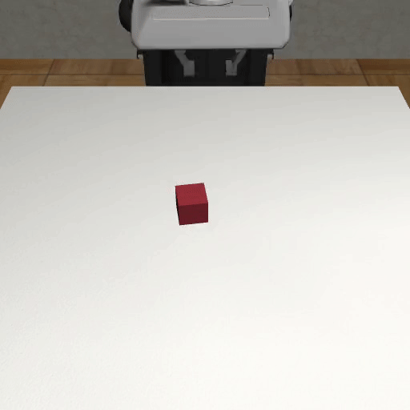
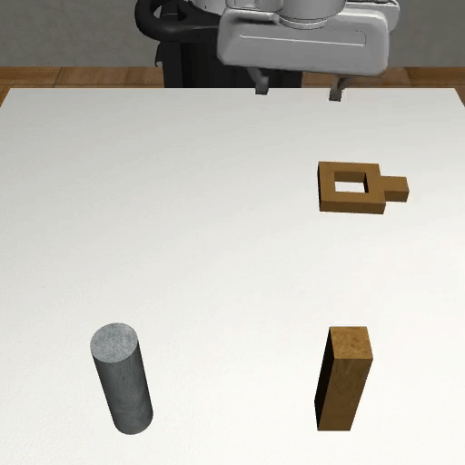
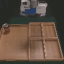

# Overview

<p align="center">
  
  
  
  
  
  
  
  
 </p>

**robomimic** is a framework for robot learning from demonstration, with a focus on learning from human demonstrations.
It offers a broad set of demonstration datasets collected on robot manipulation domains and offline learning algorithms to learn from these datasets.
**robomimic** aims to make robot learning broadly *accessible* and *reproducible*, allowing researchers and practitioners to benchmark tasks and algorithms fairly and to develop the next generation of robot learning algorithms.

## Core Features

<!-- <style>
.feature-box {
    padding: 30px 20px;
    margin-bottom: 50px;
    text-align: center;
    border: 1px solid #e6e6e6;
    height: 400px;
    position: relative;
    background: #faf0f0;
}

.col-xl, .col-xl-auto, .col-xl-12, .col-xl-11, .col-xl-10, .col-xl-9, .col-xl-8, .col-xl-7, .col-xl-6, .col-xl-5, .col-xl-4, .col-xl-3, .col-xl-2, .col-xl-1, .col-lg, .col-lg-auto, .col-lg-12, .col-lg-11, .col-lg-10, .col-lg-9, .col-lg-8, .col-lg-7, .col-lg-6, .col-lg-5, .col-lg-4, .col-lg-3, .col-lg-2, .col-lg-1, .col-md, .col-md-auto, .col-md-12, .col-md-11, .col-md-10, .col-md-9, .col-md-8, .col-md-7, .col-md-6, .col-md-5, .col-md-4, .col-md-3, .col-md-2, .col-md-1, .col-sm, .col-sm-auto, .col-sm-12, .col-sm-11, .col-sm-10, .col-sm-9, .col-sm-8, .col-sm-7, .col-sm-6, .col-sm-5, .col-sm-4, .col-sm-3, .col-sm-2, .col-sm-1, .col, .col-auto, .col-12, .col-11, .col-10, .col-9, .col-8, .col-7, .col-6, .col-5, .col-4, .col-3, .col-2, .col-1 {
    position: relative;
    width: 100%;
    padding-right: 0.75rem;
    padding-left: 0.75rem;
}

.text-center {
    text-align: center !important;
}
.row {
    display: flex;
    flex-wrap: wrap;
    margin-right: -0.75rem;
    margin-left: -0.75rem;
}

@media (min-width: 576px)
.container-sm, .container {
    max-width: 540px;
}

</style>


<div class container>
  <div class="row text-center">
    <div class="col-lg-3 col-md-6">
        <div class="feature-box">
            <h5 class="my-3">6-DoF Intuitive User Interface</h5>
            <p class="text-muted">We provide 6 degree of freedom intuitive motion control which maps phone movement to robot arm movement.</p>
        </div>
    </div>
    <div class="col-lg-3 col-md-6">
        <div class="feature-box">
            <h5 class="my-3">Simultaneous Users</h5>
            <p class="text-muted">RoboTurk can host multiple simultaenous users that each control a robot arm in its own workspace, as well as multiple users that control robot arms in a shared workspace, allowing for demonstrations on collaborative and adversarial tasks.</p>
        </div>
    </div>
    <div class="col-lg-3 col-md-6">
        <div class="feature-box">
            <h5 class="my-3">Worldwide Low-Latency Robot Teleoperation</h5>
            <p class="text-muted">Real-time robot control of simulated and physical robot arms from across the world. This has been stress-tested by controlling robot arms at Stanford from far locations such as China and India.</p>
        </div>
    </div>
    <div class="col-lg-3 col-md-6">
        <div class="feature-box">
            <h5 class="my-3">Human-in-the-Loop Intervention Mechanism</h5>
            <p class="text-muted">Users can watch an autonomous robot arm try to solve tasks and provide assistance when necessary, helping the robot learn from its mistakes.</p>
        </div>
    </div>
  </div>
</div> -->


<style>
  .column {
      width: 45%;
      float: left;
      margin-right: 3%;
      margin-bottom: 20px;
      text-align: center;
      padding: 20px;
      height: 250px;
  }

  .column:last-child {
      margin-right: 0;
  }

  .clear {
      clear: both;
  }
  
  @media screen and (max-width : 1024px) {
    .column {
		width: 50%;
		float: left;
		margin-right: 0;
		padding: 15px;
	}
}

@media screen and (max-width : 767px) {
    .column {
		width: 100%;
		float: none;
		padding: 15px 0;
	}
}
</style>

<div class="row">
  <div class="column" style="background-color:#DEEEFB;">
    <h4>Suite of Learning Algorithms</h4>
    <p>High-quality implementations of offline learning algorithms, including BC, BC-RNN, HBC, IRIS, BCQ, CQL, and TD3-BC</p>
  </div>
  <div class="column" style="background-color:#DEEEFB;">
    <h4>Standardized Datasets</h4>
    <p>Datasets collected from different sources (single proficient human, multiple humans, and machine-generated) across simulated and real-world tasks spanning multiple robots and environments</p>
  </div>
  <div class="column" style="background-color:#DEEEFB;">
    <h4>Modular Design</h4>
    <p>Support for learning both low-dimensional and visuomotor policies, diverse network architectures, and interface to easily use external datasets</p>
  </div>
  <div class="column" style="background-color:#DEEEFB;">
    <h4>Flexible Experiment Workflow</h4>
    <p>Utilities for running hyperparameter sweeps, visualizing demonstration data and trained policies, and collecting new datasets using trained policies</p>
  </div>
</div>


<!-- 1. **Offline Learning Algorithms**
High-quality implementations of offline learning algorithms, including BC, BC-RNN, HBC, IRIS, BCQ, CQL, and TD3-BC
2. **Standardized Datasets**
Datasets collected from different sources (single proficient human, multiple humans, and machine-generated) across simulated and real-world tasks spanning multiple robots and environments
3. **Modular Design**
Support for learning both low-dimensional and visuomotor policies, diverse network architectures, and interface to easily use external datasets
4. **Flexible Experiment Workflow**
Utilities for running hyperparameter sweeps, visualizing demonstration data and trained policies, and collecting new datasets using trained policies -->

## Reproducing benchmark study results

The robomimic framework also makes reproducing the results from this [benchmark study](https://arise-initiative.github.io/robomimic-web/study) easy. See the [reproducing results documentation](./results.html) for more information.

## Troubleshooting

Please see the [troubleshooting](../miscellaneous/troubleshooting.html) section for common fixes, or [submit an issue](https://github.com/ARISE-Initiative/robomimic/issues) on our github page.

## Contributing to robomimic
This project is part of the broader [Advancing Robot Intelligence through Simulated Environments (ARISE) Initiative](https://github.com/ARISE-Initiative), with the aim of lowering the barriers of entry for cutting-edge research at the intersection of AI and Robotics.
The project originally began development in late 2018 by researchers in the [Stanford Vision and Learning Lab](http://svl.stanford.edu/) (SVL).
Now it is actively maintained and used for robotics research projects across multiple labs.
We welcome community contributions to this project.
For details please check our [contributing guidelines](../miscellaneous/contributing.html).

## Citation

Please cite [this paper](https://arxiv.org/abs/2108.03298) if you use this framework in your work:

```
@inproceedings{robomimic2021,
  title={What Matters in Learning from Offline Human Demonstrations for Robot Manipulation},
  author={Ajay Mandlekar and Danfei Xu and Josiah Wong and Soroush Nasiriany and Chen Wang and Rohun Kulkarni and Li Fei-Fei and Silvio Savarese and Yuke Zhu and Roberto Mart\'{i}n-Mart\'{i}n},
  booktitle={Conference on Robot Learning (CoRL)},
  year={2021}
}
```