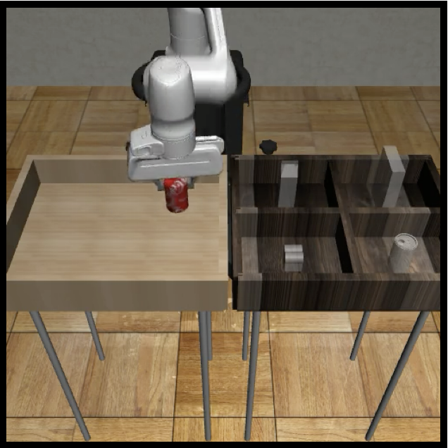
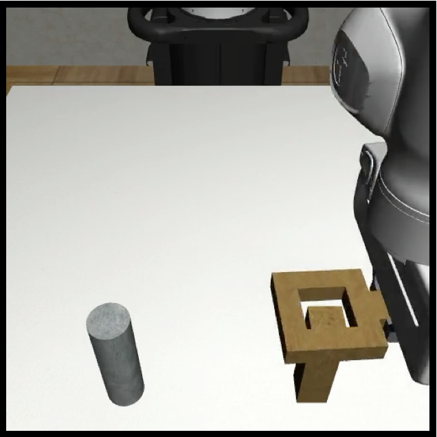
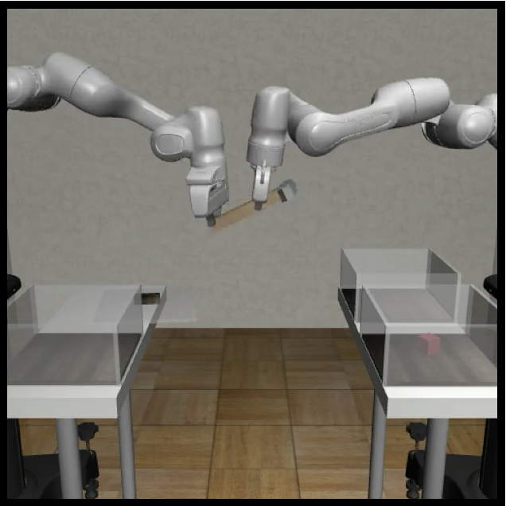

# robomimic-v0.1

We provide links below to several pretrained models that were trained with robomimic-v0.1 for our CoRL 2021 study. All success rates listed below are approximate - they may vary.

Note: see tutorial on using these models

See the ["Using Pretrained Models"](../tutorials/using_pretrained_models.html) tutorial for instructions on using these models.

Warning: use correct robosuite branch!

When using these trained models, please make sure that robosuite is on the `offline_study` branch of robosuite.

## Proficient-Human (PH)

### Lift (PH)

#### BC-RNN

- low-dim agent (success rate ~100%) ([download](http://downloads.cs.stanford.edu/downloads/rt_benchmark/model_zoo/lift/bc_rnn/lift_ph_low_dim_epoch_1000_succ_100.pth))
- image agent (success rate ~100%) ([download](http://downloads.cs.stanford.edu/downloads/rt_benchmark/model_zoo/lift/bc_rnn/lift_ph_image_epoch_500_succ_100.pth))

### Can (PH)

#### BC-RNN

- low-dim agent (success rate ~100%) ([download](http://downloads.cs.stanford.edu/downloads/rt_benchmark/model_zoo/can/bc_rnn/can_ph_low_dim_epoch_1150_succ_100.pth))

- image agent (success rate ~100%) ([download](http://downloads.cs.stanford.edu/downloads/rt_benchmark/model_zoo/can/bc_rnn/can_ph_image_epoch_300_succ_100.pth))

  

### Square (PH)

#### BC-RNN

- low-dim agent (success rate ~84%) ([download](http://downloads.cs.stanford.edu/downloads/rt_benchmark/model_zoo/square/bc_rnn/square_ph_low_dim_epoch_1850_succ_84.pth))

- image agent (success rate ~78%) ([download](http://downloads.cs.stanford.edu/downloads/rt_benchmark/model_zoo/square/bc_rnn/square_ph_image_epoch_540_succ_78.pth))

  

### Transport (PH)

#### BC-RNN

- low-dim agent (success rate ~78%) ([download](http://downloads.cs.stanford.edu/downloads/rt_benchmark/model_zoo/transport/bc_rnn/transport_ph_low_dim_epoch_1000_succ_78.pth))

- image agent (success rate ~70%) ([download](http://downloads.cs.stanford.edu/downloads/rt_benchmark/model_zoo/transport/bc_rnn/transport_ph_image_epoch_580_succ_70.pth))

  

### Tool Hang (PH)

#### BC-RNN

- low-dim agent (success rate ~14%) ([download](http://downloads.cs.stanford.edu/downloads/rt_benchmark/model_zoo/tool_hang/bc_rnn/tool_hang_ph_low_dim_epoch_2000_succ_14.pth))
- image agent (success rate ~ 50-74%) ([download](http://downloads.cs.stanford.edu/downloads/rt_benchmark/model_zoo/tool_hang/bc_rnn/tool_hang_ph_image_epoch_440_succ_74.pth))

