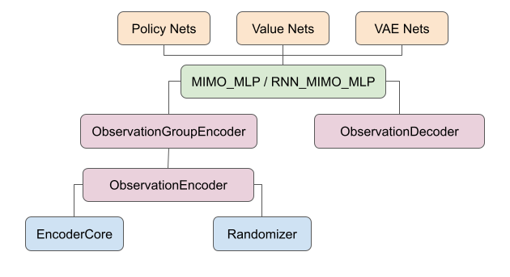
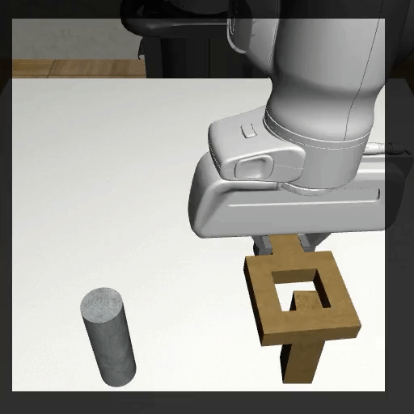

# Models

<p align="center">
  
 </p>

**robomimic** implements a suite of reusable network modules at different abstraction levels that make creating new policy models easy. 


## Base Modules
To support automated shape resolution when dealing with multiple modalities, all basic modules such as MLP and ConvNets defined in `robomimic.models.base_nets` are a subclass of `robomimic.models.base_nets.Module`, which requires implementing the abstract method `output_shape(self, input_shape=None)`. The function resolves the output shape (excluding the batch dimension) of the module either based on an external `input_shape` or internal instance variables. To implement new base modules, simply inherit `robomimic.models.Module` or `robomimic.models.ConvBase` (if adding a ConvNet) and implement the abstract functions. Below is a sample implementation of a ResNet-18 base module.

```python
from robomimic.models.base_nets import ConvBase

class ResNet18Conv(ConvBase):

  ...

  def output_shape(self, input_shape):
      """
      Function to compute output shape from inputs to this module. 

      Args:
          input_shape (iterable of int): shape of input. Does not include batch dimension.
              Some modules may not need this argument, if their output does not depend 
              on the size of the input, or if they assume fixed size input.

      Returns:
          out_shape ([int]): list of integers corresponding to output shape
      """
      assert(len(input_shape) == 3)
      out_h = int(math.ceil(input_shape[1] / 32.))
      out_w = int(math.ceil(input_shape[2] / 32.))
      return [512, out_h, out_w]
```

## EncoderCore
We create the `EncoderCore` abstract class to encapsulate any network intended to encode a specific type of observation modality (e.g.: `VisualCore` for RGB and depth observations, and `ScanCore` for range scanner observations. See below for descriptions of both!). When a new encoder class is subclassed from `EncoderCore`, it will automatically be registered internally in robomimic, allowing the user to directly refer to their custom encoder classes in their config in string form. For example, if the user specifies a custom `EncoderCore`-based class named `MyCustomRGBEncoder` to encode RGB observations, they can directly set this in their config:

```python
config.observation.encoder.rgb.core_class = "MyCustomRGBEncoder"
config.observation.encoder.rgb.core_kwargs = ...
```

Any corresponding keyword arguments that should be passed to the encoder constructor should be specified in `core_kwargs` in the config. For more information on creating your own custom encoder, please see our [example script](../introduction/examples.html#custom-observation-modalities-example).

Below, we provide descriptions of specific EncoderCore-based classes used to encode RGB and depth observations (`VisualCore`) and range scanner observations (`ScanCore`).


### VisualCore
We provide a `VisualCore` module for constructing custom vision architectures. A `VisualCore` consists of a backbone network that featurizes image input --- typically a `ConvBase` module --- and a pooling module that reduces the feature tensor into a fixed-sized vector representation.  Below is a `VisualCore` built from a `ResNet18Conv` backbone and a `SpatialSoftmax` ([paper](https://rll.berkeley.edu/dsae/dsae.pdf)) pooling module. 

```python
from robomimic.models.obs_core import VisualCore
from robomimic.models.base_nets import ResNet18Conv, SpatialSoftmax

vis_net = VisualCore(
  input_shape=(3, 224, 224),
  core_class="ResNet18Conv",  # use ResNet18 as the visualcore backbone
  core_kwargs={"pretrained": False, "input_coord_conv": False},  # kwargs for the ResNet18Conv class
  pool_class="SpatialSoftmax",  # use spatial softmax to regularize the model output
  pool_kwargs={"num_kp": 32},  # kwargs for the SpatialSoftmax --- use 32 keypoints
  flatten=True,  # flatten the output of the spatial softmax layer
  feature_dimension=64,  # project the flattened feature into a 64-dim vector through a linear layer 
)
```

New vision backbone and pooling classes can be added by subclassing `ConvBase`. 


### ScanCore
We provide a `ScanCore` module for constructing custom range finder architectures. `ScanCore` consists of a 1D Convolution backbone network (`Conv1dBase`) that featurizes a high-dimensional 1D input, and a pooling module that reduces the feature tensor into a fixed-sized vector representation.  Below is an example of a `ScanCore` network with a `SpatialSoftmax` ([paper](https://rll.berkeley.edu/dsae/dsae.pdf)) pooling module.

```python
from robomimic.models.obs_core import ScanCore
from robomimic.models.base_nets import SpatialSoftmax

vis_net = ScanCore(
  input_shape=(1, 120),
  conv_kwargs={
      "out_channels": [32, 64, 64],
      "kernel_size": [8, 4, 2],
      "stride": [4, 2, 1],
  },    # kwarg settings to pass to individual Conv1d layers
  conv_activation="relu",   # use relu in between each Conv1d layer
  pool_class="SpatialSoftmax",  # use spatial softmax to regularize the model output
  pool_kwargs={"num_kp": 32},  # kwargs for the SpatialSoftmax --- use 32 keypoints
  flatten=True,  # flatten the output of the spatial softmax layer
  feature_dimension=64,  # project the flattened feature into a 64-dim vector through a linear layer 
)
```


## Randomizers

Randomizers are `Modules` that perturb network inputs during training, and optionally during evaluation. A `Randomizer` implements a `forward_in` and a `forward_out` function, which are intended to process the input and output of a neural network module. As an example, the `forward_in` function of a `CropRandomizer` instance perturbs an input image by taking a random crop of the image (as shown in th gif below). If the `CropRandomizer` is configured to take more than one random crop (`n_crops > 1`) of each input image, it will send all random crops through the image network and reduce the network output by average pooling the outputs along the `n_crops` dimension in the `forward_out` function.



`Randomizer` modules are intended to be used alongside an `ObservationEncoder` --- see the next section for more details. Additional randomizer classes can be implemented by subclassing the `Randomizer` class and implementing the necessary abstract functions. 

**Visualizing randomized input:** To visualize the original and randomized image input, set `VISUALIZE_RANDOMIZER = True` in `robomimic/macros.py`

## Observation Encoder and Decoder
 `ObservationEncoder` and `ObservationDecoder` are basic building blocks for dealing with observation dictionary inputs and outputs. They are designed to take in multiple streams of observation modalities as input (e.g. a dictionary containing images and robot proprioception signals), and output a dictionary of predictions like actions and subgoals. Below is an example of how to manually create an `ObservationEncoder` instance by registering observation modalities with the `register_obs_key` function.

```python
from robomimic.models.base_nets import MLP
from robomimic.models.obs_core import VisualCore, CropRandomizer
from robomimic.models.obs_nets import ObservationEncoder, ObservationDecoder

obs_encoder = ObservationEncoder(feature_activation=torch.nn.ReLU)

# There are two ways to construct the network for processing a input modality.
# Assume we are processing image input of shape (3, 224, 224).
camera1_shape = [3, 224, 224]

image_randomizer = CropRandomizer(input_shape=camera2_shape, crop_height=200, crop_width=200)

# We will use a reconfigurable image processing backbone VisualCore to process the input image modality
net_class = "VisualCore"  # this is defined in models/base_nets.py

# kwargs for VisualCore network
net_kwargs = {
    "input_shape": camera1_shape,
    "core_class": "ResNet18Conv",  # use ResNet18 as the visualcore backbone
    "core_kwargs": {"pretrained": False, "input_coord_conv": False},
    "pool_class": "SpatialSoftmax",  # use spatial softmax to regularize the model output
    "pool_kwargs": {"num_kp": 32}
}

# register the network for processing the modality
obs_encoder.register_obs_key(
    name="camera1",
    shape=camera1_shape,
    net_class=net_class,
    net_kwargs=net_kwargs,
    randomizer=image_randomizer
)

# We could mix low-dimensional observation, e.g., proprioception signal, in the encoder
proprio_shape = [12]
net = MLP(input_dim=12, output_dim=32, layer_dims=(128,), output_activation=None)
obs_encoder.register_obs_key(
    name="proprio",
    shape=proprio_shape,
    net=net
)
```

By default, each modality network should reduce an input observation stream to a fixed-size vector. The output of the `forward` function of the `ObservationEncoder` is simply the concatenation of all the vectors. The order of concatenation is deterministic and is the the same as the order that the modalities are registered. `ObservationGroupEncoder` further supports encoding nested groups of observations, e.g., `obs`, `goal`, and `subgoal`. This allows constructing goal-conditioned and / or subgoal-conditioned policy models.

However, it can be tedious to enumerate all modalities when creating a policy model. The standard entry point to create an `ObservationEncoder` is via the `observation_encoder_factory` function in `robomimic.models.obs_nets`. It will enumerate all observation modalities and initialize all modality networks according to the configurations provided by the `config.observation` config section.

The `ObservationDecoder` class is relatively straightforward. It's simply a single-input, multi-output-head MLP. For example, the following snippet creates an `ObservationDecoder` that takes the output of the observation encoder as input and outputs two action predictions.

```python
obs_decoder = ObservationDecoder(
    input_feat_dim=obs_encoder.output_shape()[0],
    decode_shapes=OrderedDict({"action_pos": (3,), "action_orn": (4,)})
)
```

See `examples/simple_obs_nets.py` for the complete example that shows additional functionalities such as weight sharing among modality networks.


## Multi-Input, Multi-Output (MIMO) Modules
`MIMO_MLP` and `RNN_MIMO_MLP` are highest-level wrappers that use `ObservationGroupEncoder` and `ObservationDecoder` to create multi-input, multi-output network architectures. `MIMO_MLP` optionally adds additional MLP layers before piping the encoded feature vector to the decoder. 

`RNN_MIMO_MLP` encodes each observation in an observation sequence using `ObservationGroupEncoder` and digests the feature sequence using RNN-variants such as LSTM and GRU networks. 

`MIMO_MLP` and `RNN_MIMO_MLP` serve as **the backbone for all policy and value network models** -- these models simple subclass a `MIMO_MLP` or `RNN_MIMO_MLP`, and adds specific input and output shapes.

## Implemented Policy Networks

These networks take an observation dictionary as input (and possibly additional conditioning, such as subgoal or goal dictionaries) and produce action predictions, samples, or distributions as outputs. Note that actions are assumed to lie in `[-1, 1]`, and most networks will have a final `tanh` activation to help ensure that outputs lie within this range. See `robomimic/models/policy_nets.py` for complete implementations.

### ActorNetwork
- A basic policy network that predicts actions from observations. Can optionally be goal conditioned on future observations.
### PerturbationActorNetwork
- An action perturbation network - primarily used in BCQ. It takes states and actions and returns action perturbations.
### GaussianActorNetwork
- Variant of actor network that outputs a diagonal unimodal Gaussian distribution as action predictions.
### GMMActorNetwork
- Variant of actor network that outputs a multimodal Gaussian mixture distribution as action predictions.
### RNNActorNetwork
- An RNN policy network that predicts actions from a sequence of observations.
### RNNGMMActorNetwork
- An RNN policy network that outputs a multimodal Gaussian mixture distribution over actions from a sequence of observations.
### VAEActor
- A VAE that models a distribution of actions conditioned on observations. The VAE prior and decoder are used at test-time as the policy.

## Implemented Value Networks
These networks take an observation dictionary as input (and possibly additional conditioning, such as subgoal or goal dictionaries) and produce value or action-value estimates or distributions. See `robomimic/models/value_nets.py` for complete implementations.
### ValueNetwork
- A basic value network that predicts values from observations. Can optionally be goal conditioned on future observations.
### DistributionalActionValueNetwork
- Distributional Q (action-value) network that outputs a categorical distribution over a discrete grid of value atoms. See the [paper](https://arxiv.org/pdf/1707.06887.pdf) for more details.

## Implemented VAEs
The library implements a general VAE architecture and a number of prior distributions. See `robomimic/models/vae_nets.py` for complete implementations.

### VAE
A general Variational Autoencoder (VAE) implementation, as described in https://arxiv.org/abs/1312.6114.

Models a distribution p(X) or a conditional distribution p(X | Y), where each variable can consist of multiple modalities. The target variable X, whose distribution is modeled, is specified through the `input_shapes` argument, which is a map between modalities (strings) and expected shapes. In this way, a variable that consists of multiple kinds of data (e.g. image and flat-dimensional) can be modeled as well. A separate `output_shapes` argument is used to specify the expected reconstructions - this allows for asymmetric reconstruction (for example, reconstructing low-resolution images).

This implementation supports learning conditional distributions as well (cVAE). The conditioning variable Y is specified through the `condition_shapes` argument, which is also a map between modalities (strings) and expected shapes. In this way, variables with multiple kinds of data (e.g. image and flat-dimensional) can jointly be conditioned on. By default, the decoder takes the conditioning variable Y as input. To force the decoder to reconstruct from just the latent, set `decoder_is_conditioned` to False (in this case, the prior must be conditioned).

The implementation also supports learning expressive priors instead of using the usual N(0, 1) prior. There are three kinds of priors supported - Gaussian, Gaussian Mixture Model (GMM), and Categorical. For each prior, the parameters can be learned as independent parameters, or be learned as functions of the conditioning variable Y (by setting `prior_is_conditioned`).

### GaussianPrior
- A class that holds functionality for learning both unimodal Gaussian priors and multimodal Gaussian Mixture Model priors for use in VAEs. Supports learnable priors, learnable / fixed mixture weights for GMM, and observation-conditioned priors, 
### CategoricalPrior
- A class that holds functionality for learning categorical priors for use in VAEs.