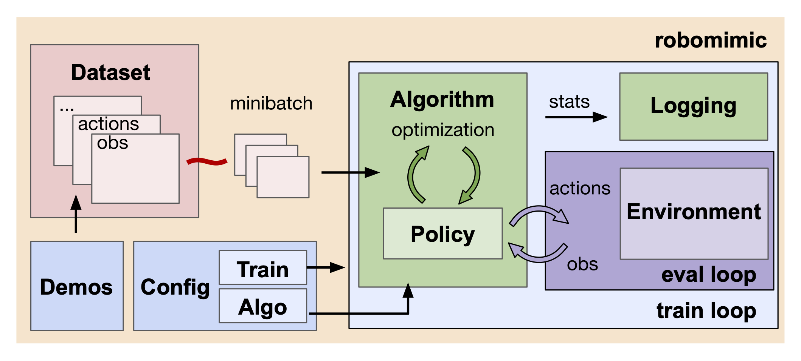

# Overview

  
 

The **robomimic** framework consists of several modular components that interact to train and evaluate a policy:
- **Experiment config**: a config object defines all settings for a training run
- **Data**: an hdf5 dataset is loaded into a dataloader, which provides minibatches to the algorithm
- **Training**: an algorithm object trains a set of models (including the policy)
- **Evaluation**: the policy is evaluated in the environment by conducting a set of rollouts
- **Logging**: experiment statistics, model checkpoints, and videos are saved to disk

These modules are encapsulated by the robomimic directory structure:

- `examples`: examples to better understand modular components in the codebase
- [`robomimic/algo`](./algorithms.html): policy learning algorithm implementations
- [`robomimic/config`](./configs.html): default algorithm configs
- [`robomimic/envs`](./environments.html): wrappers for environments, used during evaluation rollouts
- `robomimic/exps/templates`: config templates for experiments
- [`robomimic/models`](./models.html): network implementations
- `robomimic/scripts`: main repository scripts 
- `robomimic/utils`: a collection of utilities, including the [SequenceDataset](./dataset.html) class to load datasets, and [TensorUtils](../tutorials/tensor_collections.html#tensorutils) to work with nested tensor dictionaries 

