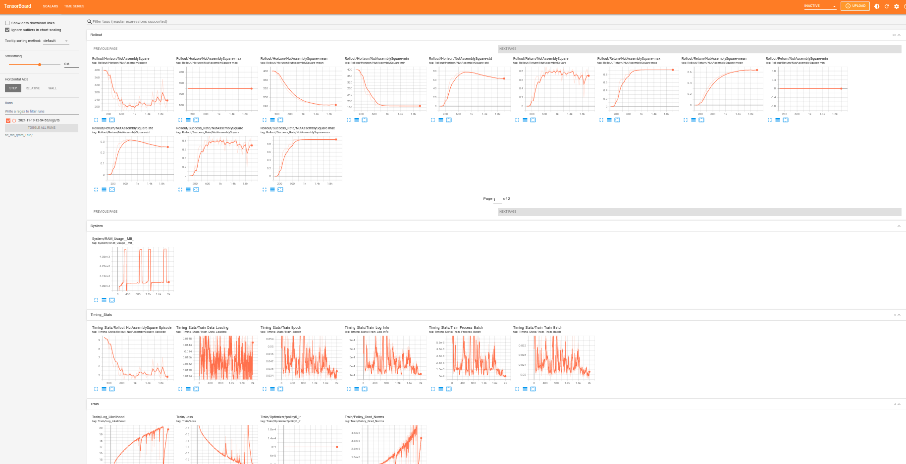

# Logging and Viewing Training Results

In this section, we describe how to configure the logging and evaluations that occur during your training run, and how to view the results of a training run.

## Configuring Logging

### Saving Experiment Logs 
Configured under `experiment.logging`:
```
"logging": {
    # save terminal outputs under `logs/log.txt` in experiment folder
    "terminal_output_to_txt": true,
    
    # save tensorboard logs under `logs/tb` in experiment folder
    "log_tb": true

    # save wandb logs under `logs/wandb` in experiment folder
    "log_wandb": true
},
```

### Saving Model Checkpoints
Configured under `experiment.save`:
```
"save": {
    # enable saving model checkpoints
    "enabled": true,
    
    # controlling frequency of checkpoints
    "every_n_seconds": null,
    "every_n_epochs": 50,
    "epochs": [],
    
    # saving the best checkpoints
    "on_best_validation": false,
    "on_best_rollout_return": false,
    "on_best_rollout_success_rate": true
},
```

### Evaluating Rollouts and Saving Videos
#### Evaluating Rollouts
Configured under `experiment.rollout`:
```
"rollout": {
    "enabled": true,              # enable evaluation rollouts
    "n": 50,                      # number of rollouts per evaluation
    "horizon": 400,               # number of timesteps per rollout
    "rate": 50,                   # frequency of evaluation (in epochs)
    "terminate_on_success": true  # terminating rollouts upon task success
}
```

#### Saving Videos
To save videos of the rollouts, set `experiment.render_video` to `true`.

## Viewing Training Results

### Contents of Training Outputs
After the script finishes, you can check the training outputs in the `<train.output_dir>/<experiment.name>/<date>` experiment directory:
```
config.json               # config used for this experiment
logs/                     # experiment log files
  log.txt                    # terminal output
  tb/                        # tensorboard logs
  wandb/                     # wandb logs
videos/                   # videos of robot rollouts during training
models/                   # saved model checkpoints
```

<div class="admonition tip">
<p class="admonition-title">Loading Trained Checkpoints</p>

Please see the [Using Pretrained Models](./using_pretrained_models.html) tutorial to see how to load the trained model checkpoints in the `models` directory.

</div>

### Viewing Tensorboard Results
The experiment results can be viewed using tensorboard:
```sh
$ tensorboard --logdir <experiment-log-dir> --bind_all
```
Below is a snapshot of the tensorboard dashboard:
<a href="../images/tensorboard.png" target="_blank">
<p align="center">
  
</p>
</a>

Experiment results (y-axis) are logged across epochs (x-axis).
You may find the following logging metrics useful:
- `Rollout/`: evaluation rollout metrics, eg. success rate, rewards, etc.
  - `Rollout/Success_Rate/{envname}-max`: maximum success rate over time (this is the metric the [study paper](https://arxiv.org/abs/2108.03298) uses to evaluate baselines)
- `Timing_Stats/`: time spent by the algorithm loading data, training, performing rollouts, etc.
- `Timing_Stats/`: time spent by the algorithm loading data, training, performing rollouts, etc.
- `Train/`: training stats
- `Validation/`: validation stats
- `System/RAM Usage (MB)`: system RAM used by algorithm